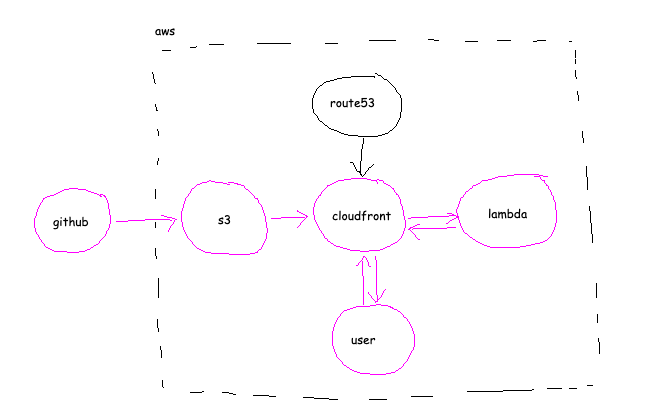

# Helpcentre

## Working Locally

### Dependencies

- NodeJS

### Running

Any number of the commands to minify the assets can be run such as `npm run minify:js` or there's a `npm start` command that'll build the majority of the assets and then serve the application on `http://localhost:5000`

At the moment this hasn't been written to _watch_ files and/or generate minified css on the fly.

### Adding new clients

If you wish to add a new client, add a new folder to the `clients/` folder with the project number, then add the `index.html` file either from the root or one of the clients. If you require overrides add the `client.css` file and make your changes.

This is all picked up on build as we look for `client.css` and `index.html` within `clients/*`

Note: If you use the `index.html` file from the root directory it doesn't include the `<link rel="stylesheet" href="client.min.css" type="text/css"/>` you probably need to include the stylesheet overrides in that folder.

You can also just add `<style> // your styles </style>` to the `<head></head>` as there's nothing really stopping you doing that either.

## Deployment

The helpcentre is deployed using GitHub Actions. It minifies the css, js and html and then copies it with `s3 sync` to S3, once there it's only visible through CloudFront.

When the application is deployed the dist/ folder that's generated is copied to the following:
- dist/ is copied to the /* of the bucket
- dist/ is copied to /helpcentre on the bucket

If we're building a pull request then the dist/ folder is copied to the github.head_ref/github.pull_request.number so if you had a branch named tfl for example you'd have a folder in S3 called `/tfl/1/` which would be accessible via https://helpcentre.enginetransformation.com/tfl/1/ for the 'main' non-bespoke client endpoint or https://helpcentre.enginetransformation.com/tfl/1/client-number/

## Architecture



### Services

The application utilizes static website hosting within S3 to serve content via CloudFront. It's permissions are blocked to everything other than the request from CloudFront as an Origin Access Identity.

```
{
    "Version": "2012-10-17",
    "Id": "PolicyForCloudFrontPrivateContent",
    "Statement": [
        {
            "Effect": "Allow",
            "Principal": {
                "AWS": "arn:aws:iam::cloudfront:user/CloudFront Origin Access Identity *************"
            },
            "Action": "s3:GetObject",
            "Resource": "arn:aws:s3:::research-ops-static-sites/*"
        }
    ]
}
```

Further to this there is a Lambda function that strips `/index.html` from subdirectories written as a quick node script. This is connected to CloudFront via a Lambda function association on the Origin Request.

There's a gotcha here though that as of currently the lambda has to run in us-east-1 due to avaliablity on CloudFront and Lambda associations.
